# ✦ L'Artisan Baking Atelier

<div align="center">


### **The Artisan's Codex** — Where Centuries of Baking Wisdom Meet Digital Excellence

[](https://react.dev/)
[](https://www.typescriptlang.org/)
[](https://tailwindcss.com/)
[](https://vitejs.dev/)
[](LICENSE)

**A Singapore-based e-commerce platform for artisan baking education, featuring the "Noir Artisanal Codex" design system — a dark, cinematic, and unforgettable aesthetic experience.**

[Live Demo](#) · [View Design System](#design-system) · [Report Bug](../../issues) · [Request Feature](../../issues)

</div>

---

## 📋 Table of Contents

- [Overview](#-overview)
- [Design Philosophy](#-design-philosophy)
- [Features](#-features)
- [Quick Start](#-quick-start)
- [Architecture](#-architecture)
- [User Interaction Flow](#-user-interaction-flow)
- [Application Logic Flow](#-application-logic-flow)
- [Design System](#-design-system)
- [Deployment](#-deployment)
- [Contributing](#-contributing)
- [License & Acknowledgments](#-license--acknowledgments)

---

## 🎯 Overview

L'Artisan Baking Atelier is a premium digital education platform that transforms home bakers into artisans. This repository contains the frontend implementation featuring a meticulously crafted "Noir Artisanal Codex" aesthetic — a bold departure from generic e-commerce templates.

### What Makes This Project Unique?

| Aspect | Traditional Approach | Our Approach |
|--------|---------------------|--------------|
| **Color Palette** | Light backgrounds, muted tones | Dark void (#0A0A0A) with gold illuminations |
| **Typography** | Inter, Roboto, system fonts | Bodoni Moda + Instrument Sans pairing |
| **Visual Language** | Card grids, standard heroes | Cinematic reveals, manuscript aesthetics |
| **Interactions** | Basic hover states | Scroll-triggered animations, particle systems |
| **Cultural Context** | Generic global | Singapore-rooted with Peranakan geometric patterns |

### Key Differentiators

- 🌑 **Noir Codex Aesthetic** — Dark, sumptuous void as canvas with gold-leaf illuminations
- 🎭 **Cinematic Experience** — Every scroll reveals content like turning manuscript pages
- 🔮 **Floating Golden Particles** — Subtle ambient particles create depth and magic
- 🏛️ **Peranakan Geometry** — Cultural nod to Singapore through decorative corner flourishes
- ⚡ **Zero JavaScript Animation Libraries** — Pure CSS animations for optimal performance

---

## 🎨 Design Philosophy

This project embodies the **"Anti-Generic"** design pledge, rejecting:

- ❌ Safe template aesthetics and "AI slop"
- ❌ Overused font families (Inter, Roboto, Arial)
- ❌ Purple-gradient-on-white clichés
- ❌ Predictable card grids and hero sections

**Instead, we embrace:**

- ✅ Intentional minimalism where whitespace speaks louder than decoration
- ✅ Asymmetry and unexpected layouts with purpose
- ✅ Distinctive typography that commands attention
- ✅ Every element earning its place through calculated purpose

### The Conceptual Synthesis

This design combines five radical directions:

1. **Noir Codex** → Dark sophistication, manuscript aesthetics
2. **Kinetic Editorial** → Bold asymmetric typography, dramatic scale
3. **Sensorial Cinema** → Full-bleed imagery, reveal animations
4. **Tropical Brutalist** → Peranakan patterns as cultural identity
5. **Digital Atelier** → Craft metaphors, precision, intentional minimalism

---

## ✨ Features

### Visual Features

- **Scroll-Triggered Animations** — Elements reveal on viewport entry with staggered timing
- **Golden Particle System** — 20 floating particles create ambient depth
- **Grain Texture Overlay** — Subtle noise for organic, tactile feel
- **Glass Morphism Navigation** — Backdrop blur on scroll
- **Hover Lift Cards** — 12px elevation with golden glow on interaction
- **Concentric Ring Effects** — Animated rings around mentor portraits
- **SVG Corner Flourishes** — Peranakan-inspired decorative elements

### Technical Features

- **TypeScript Strict Mode** — Full type safety with no `any` types
- **Custom Hooks Architecture** — `useScrollAnimation`, `useNavScroll` for reusability
- **Intersection Observer API** — Performance-optimized scroll detection
- **CSS Custom Properties** — Complete theming via `@theme` directive
- **Single-File Build** — Vite plugin bundles everything into one HTML file
- **Responsive Design** — Mobile-first with breakpoints for all screen sizes

### UX Features

- **WCAG Accessibility** — Semantic HTML, proper heading hierarchy, focus states
- **Optimized Performance** — CSS-only animations, passive scroll listeners
- **Form State Management** — Loading, success, and error states for newsletter
- **Smooth Scroll Navigation** — Native CSS scroll-behavior with 80px offset

---

## 🚀 Quick Start

### Prerequisites

Ensure you have the following installed:

- **Node.js** >= 18.0.0
- **npm** >= 9.0.0 or **pnpm** >= 8.0.0

### Installation

```bash
# 1. Clone the repository
git clone https://github.com/your-username/lartisan-baking-atelier.git

# 2. Navigate to project directory
cd lartisan-baking-atelier

# 3. Install dependencies
npm install
```

### Development

```bash
# Start development server with hot reload
npm run dev

# Server runs at http://localhost:5173
```

### Production Build

```bash
# Build optimized production bundle
npm run build

# Preview production build locally
npm run preview
```

---

## 🏗️ Architecture

### File Hierarchy

```
lartisan-baking-atelier/
├── 📁 public/                    # Static assets (if any)
│
├── 📁 src/
│   ├── 📄 App.tsx               # ⭐ Main application component
│   │                            #    Contains all section components:
│   │                            #    - Navigation, Hero, Courses
│   │                            #    - Mentors, Testimonials, Newsletter
│   │                            #    - Footer, and custom hooks
│   │
│   ├── 📄 main.tsx              # React DOM entry point
│   │                            #    Renders App in StrictMode
│   │
│   ├── 📄 index.css             # ⭐ Complete design system
│   │                            #    - @theme color tokens
│   │                            #    - Animation keyframes
│   │                            #    - Utility classes
│   │                            #    - Component styles
│   │
│   └── 📁 utils/
│       └── 📄 cn.ts             # Class name utility (clsx + tailwind-merge)
│
├── 📄 index.html                # HTML entry with Google Fonts
├── 📄 package.json              # Dependencies and scripts
├── 📄 tsconfig.json             # TypeScript configuration (strict mode)
├── 📄 vite.config.ts            # Vite + React + Tailwind + Single-file plugin
└── 📄 README.md                 # You are here
```

### Key Files Explained

| File | Purpose | Key Contents |
|------|---------|--------------|
| `src/App.tsx` | Main application component | All React components, data models, custom hooks, TypeScript interfaces |
| `src/index.css` | Design system foundation | Color tokens via `@theme`, keyframe animations, utility classes, component styles |
| `src/utils/cn.ts` | Utility function | `cn()` helper combining `clsx` and `tailwind-merge` for conditional class names |
| `vite.config.ts` | Build configuration | React plugin, Tailwind CSS plugin, single-file bundler for deployment |
| `index.html` | HTML shell | Google Fonts preconnect, meta viewport, root div mount point |

### Component Architecture

```
App (Root)
├── Navigation
│   ├── Logo
│   ├── NavLinks (Desktop)
│   ├── CTA Button
│   └── MobileMenu (Collapsible)
│
├── Hero
│   ├── Background Image + Gradients
│   ├── GeometricPattern (SVG)
│   ├── FloatingParticles (20 gold dots)
│   ├── Title + Subtitle
│   ├── CTAs (Explore, Download)
│   └── ScrollIndicator
│
├── Courses
│   ├── SectionHeader
│   └── CourseCards (3)
│       ├── CornerFlourish (SVG)
│       ├── Image + Badge
│       └── Content + Link
│
├── Mentors
│   ├── SectionHeader
│   └── MentorCards (3)
│       ├── ConcentricRings
│       ├── Portrait
│       └── Bio + Accolades
│
├── Testimonials
│   ├── SectionHeader
│   └── TestimonialCards (3)
│       ├── QuoteMark
│       └── Text + Attribution
│
├── Newsletter
│   ├── CornerFlourishes (4)
│   ├── Content
│   └── EmailForm (with states)
│
└── Footer
    ├── BrandColumn
    ├── LinkColumns (3)
    └── Copyright
```

---

## 🔄 User Interaction Flow

The following diagram illustrates how users navigate and interact with the platform:

```mermaid
flowchart TD
    subgraph Entry["🚀 ENTRY POINT"]
        A[User Lands on Homepage]
    end

    subgraph Hero["🎬 HERO SECTION"]
        B[View Hero Animation]
        B --> C{Choose Action}
        C -->|"Explore Courses"| D[Scroll to Courses]
        C -->|"Download Syllabus"| E[Jump to Newsletter]
        C -->|"Scroll Down"| F[Continue Discovery]
    end

    subgraph Navigation["📍 NAVIGATION"]
        G[Sticky Nav Appears on Scroll]
        G --> H{Select Section}
        H --> I[Courses]
        H --> J[Mentors]
        H --> K[Testimonials]
        H --> L[Codex/Newsletter]
        H --> M["Begin Journey" CTA]
    end

    subgraph Courses["📚 COURSES SECTION"]
        I --> N[View 3 Course Cards]
        N --> O{Interact with Card}
        O -->|Hover| P[See Lift Effect + Glow]
        O -->|Click Syllabus| Q[Open Course Detail*]
    end

    subgraph Mentors["👨‍🍳 MENTORS SECTION"]
        J --> R[View 3 Mentor Profiles]
        R --> S[See Ring Animation on Hover]
    end

    subgraph Testimonials["💬 TESTIMONIALS SECTION"]
        K --> T[Read Student Stories]
        T --> U[Build Trust/Social Proof]
    end

    subgraph Newsletter["📧 NEWSLETTER SECTION"]
        L --> V[View Free Guide Offer]
        E --> V
        M --> V
        V --> W[Enter Email]
        W --> X{Submit Form}
        X -->|Loading| Y[Show Loading State]
        Y --> Z{Success?}
        Z -->|Yes| AA[Show Success Message]
        Z -->|No| AB[Show Error State]
    end

    subgraph Footer["🔗 FOOTER"]
        AC[Browse Footer Links]
        AC --> AD[Explore: Courses, Mentors, etc.]
        AC --> AE[Company: About, Careers, etc.]
        AC --> AF[Connect: Social Media Links]
    end

    A --> B
    F --> G
    D --> I
    U --> L
    AA --> AC

    style A fill:#C9A962,color:#0A0A0A
    style AA fill:#4ade80,color:#0A0A0A
    style AB fill:#ef4444,color:#ffffff
    style Hero fill:#1a1a1a,stroke:#C9A962
    style Courses fill:#1a1a1a,stroke:#C9A962
    style Newsletter fill:#1a1a1a,stroke:#C9A962
```



### User Journey Stages

| Stage | Goal | Key Actions | Success Metric |
|-------|------|-------------|----------------|
| **Awareness** | Capture attention | Animated hero, striking visuals | Time on page > 30s |
| **Interest** | Showcase value | Course cards, mentor profiles | Scroll depth > 60% |
| **Desire** | Build trust | Testimonials, accolades | Engagement with newsletter |
| **Action** | Convert visitor | Email capture form | Form submission |

---

## ⚙️ Application Logic Flow

The following sequence diagram illustrates the technical flow of data and events:

```mermaid
sequenceDiagram
    autonumber
    participant User
    participant Browser
    participant App
    participant Hooks
    participant DOM
    participant CSS

    %% Initialization Phase
    rect rgb(20, 20, 20)
        Note over Browser,CSS: 🚀 INITIALIZATION PHASE
        Browser->>App: Load bundle (single HTML file)
        App->>CSS: Apply @theme variables
        CSS->>DOM: Inject grain overlay, golden glow
        App->>Hooks: Initialize useNavScroll()
        Hooks->>Browser: Attach scroll listener (passive)
        App->>DOM: Render all sections (hidden state)
    end

    %% Hero Animation Phase
    rect rgb(30, 25, 15)
        Note over User,CSS: 🎬 HERO ANIMATION PHASE
        Browser->>CSS: Trigger fadeInUp keyframes
        CSS->>DOM: Animate title (delay: 200ms)
        CSS->>DOM: Animate subtitle (delay: 400ms)
        CSS->>DOM: Animate CTAs (delay: 600ms)
        CSS->>DOM: Animate particles (float keyframe)
    end

    %% Scroll Interaction Phase
    rect rgb(20, 20, 20)
        Note over User,CSS: 📜 SCROLL DETECTION PHASE
        User->>Browser: Scrolls page
        Browser->>Hooks: useNavScroll detects Y > 80
        Hooks->>App: setScrolled(true)
        App->>DOM: Add glass-dark class to nav
        CSS->>DOM: Apply backdrop-blur, padding change
    end

    %% Section Reveal Phase
    rect rgb(30, 25, 15)
        Note over User,CSS: 👁️ INTERSECTION OBSERVER PHASE
        User->>Browser: Scrolls to Courses section
        Browser->>Hooks: useScrollAnimation triggers
        Hooks->>DOM: Check if element isIntersecting
        DOM-->>Hooks: Entry intersecting (threshold: 0.15)
        Hooks->>App: setIsVisible(true)
        App->>CSS: Apply translate-y-0, opacity-1
        CSS->>DOM: Animate cards with stagger delays
        Hooks->>Hooks: observer.disconnect()
    end

    %% Card Interaction Phase
    rect rgb(20, 20, 20)
        Note over User,CSS: 🃏 CARD HOVER PHASE
        User->>DOM: Hover on course card
        CSS->>DOM: Apply card-hover-lift
        DOM->>CSS: translateY(-12px), scale(1.02)
        DOM->>CSS: box-shadow with gold glow
        CSS->>DOM: CornerFlourish opacity increase
        User->>DOM: Mouse leave
        CSS->>DOM: Transition back (500ms ease)
    end

    %% Form Submission Phase
    rect rgb(30, 25, 15)
        Note over User,CSS: 📧 FORM SUBMISSION PHASE
        User->>DOM: Enter email, click submit
        DOM->>App: handleSubmit(event)
        App->>App: setIsSubmitting(true)
        App->>DOM: Disable button, show "Sending..."
        App->>App: setTimeout (simulate API)
        App->>App: setIsSubmitting(false)
        App->>App: setIsSubmitted(true)
        App->>DOM: Show success message
    end

    %% Mobile Menu Phase
    rect rgb(20, 20, 20)
        Note over User,CSS: 📱 MOBILE MENU PHASE
        User->>DOM: Click hamburger icon
        DOM->>App: setMobileMenuOpen(true)
        App->>DOM: Render mobile menu dropdown
        User->>DOM: Click nav link
        DOM->>App: setMobileMenuOpen(false)
        Browser->>DOM: Smooth scroll to section
    end
```



### State Management Overview

| State | Hook/Location | Purpose | Trigger |
|-------|---------------|---------|---------|
| `scrolled` | `useNavScroll()` | Toggle nav glass effect | `window.scrollY > 80` |
| `isVisible` | `useScrollAnimation()` | Trigger reveal animations | IntersectionObserver |
| `mobileMenuOpen` | `Navigation` | Toggle mobile menu | Hamburger click |
| `email` | `Newsletter` | Form input value | User typing |
| `isSubmitting` | `Newsletter` | Loading state | Form submit |
| `isSubmitted` | `Newsletter` | Success state | API response |

### Custom Hooks Deep Dive

#### `useScrollAnimation()`

```typescript
function useScrollAnimation() {
  // Creates IntersectionObserver with:
  // - threshold: 0.15 (15% visibility triggers)
  // - rootMargin: '0px 0px -50px 0px' (offset from bottom)
  // - Disconnects after first intersection (performance)
  return { ref, isVisible };
}
```

#### `useNavScroll()`

```typescript
function useNavScroll() {
  // Attaches passive scroll listener
  // Updates state when scrollY crosses 80px threshold
  // Passive flag ensures smooth scrolling performance
  return scrolled;
}
```

---

## 🎨 Design System

### Color Palette

The "Noir Artisanal Codex" palette creates a dark, luxurious atmosphere with gold illuminations:

```css
/* Dark Foundation */
--color-codex-void: #0A0A0A;      /* Deepest black - primary background */
--color-codex-charcoal: #141414;  /* Card backgrounds */
--color-codex-slate: #1E1E1E;     /* Elevated surfaces */
--color-codex-ash: #2A2A2A;       /* Borders, dividers */
--color-codex-smoke: #3D3D3D;     /* Subtle borders */

/* Neutral Tones */
--color-codex-mist: #6B6B6B;      /* Tertiary text */
--color-codex-silver: #9A9A9A;    /* Secondary text */
--color-codex-cream: #F5F0E6;     /* Primary text, warm white */

/* Accent Colors */
--color-codex-gold: #C9A962;      /* Primary accent */
--color-codex-gold-light: #E8D5A3;/* Hover states, gradients */
--color-codex-amber: #B8860B;     /* Gradient endpoint */
--color-codex-terracotta: #C67D5E;/* Secondary accent */
--color-codex-rust: #8B4513;      /* Tertiary accent */
```

### Typography

| Usage | Font | Weight | Size | Tracking |
|-------|------|--------|------|----------|
| **Display/Headings** | Bodoni Moda | 600-700 | 3rem - 9rem | -0.02em (tight) |
| **Body Text** | Instrument Sans | 400-500 | 1rem - 1.25rem | 0 (normal) |
| **Labels/Caps** | Instrument Sans | 500-600 | 0.875rem | 0.1em - 0.3em (wide) |
| **Buttons** | Instrument Sans | 600 | 0.875rem | 0.1em |

### Animation Timing

```css
/* Motion Curves */
--ease-codex-smooth: cubic-bezier(0.16, 1, 0.3, 1);    /* General transitions */
--ease-codex-elastic: cubic-bezier(0.68, -0.55, 0.265, 1.55); /* Playful bounces */
--ease-codex-dramatic: cubic-bezier(0.19, 1, 0.22, 1); /* Reveal animations */
```

| Animation | Duration | Easing | Use Case |
|-----------|----------|--------|----------|
| `fadeInUp` | 800ms | dramatic | Section reveals |
| `fadeInDown` | 800ms | dramatic | Header elements |
| `float` | 6s | ease-in-out | Particles (infinite) |
| `pulse-gold` | 3s | ease-in-out | Logo dot (infinite) |
| `card-hover` | 500ms | smooth | Card interactions |

### Spacing Scale

```css
--spacing-codex-xs: 0.5rem;   /* 8px - Tight gaps */
--spacing-codex-sm: 1rem;     /* 16px - Component padding */
--spacing-codex-md: 2rem;     /* 32px - Section gaps */
--spacing-codex-lg: 4rem;     /* 64px - Section padding */
--spacing-codex-xl: 8rem;     /* 128px - Major sections */
--spacing-codex-2xl: 12rem;   /* 192px - Hero spacing */
```

---

## 🚢 Deployment

### Build Output

This project uses `vite-plugin-singlefile` to bundle everything into a single `dist/index.html` file, making deployment trivial.

```bash
npm run build
# Output: dist/index.html (self-contained)
```

### Option 1: Vercel (Recommended)

```bash
# Install Vercel CLI
npm i -g vercel

# Deploy
vercel

# For production
vercel --prod
```

**Configuration (vercel.json):**

```json
{
  "buildCommand": "npm run build",
  "outputDirectory": "dist",
  "framework": "vite"
}
```

### Option 2: Netlify

```bash
# Install Netlify CLI
npm i -g netlify-cli

# Deploy
netlify deploy

# For production
netlify deploy --prod
```

**Configuration (netlify.toml):**

```toml
[build]
  command = "npm run build"
  publish = "dist"

[[redirects]]
  from = "/*"
  to = "/index.html"
  status = 200
```

### Option 3: GitHub Pages

```bash
# Add deploy script to package.json
# "deploy": "npm run build && gh-pages -d dist"

npm install --save-dev gh-pages
npm run deploy
```

### Option 4: Docker

```dockerfile
# Dockerfile
FROM node:18-alpine AS builder
WORKDIR /app
COPY package*.json ./
RUN npm ci
COPY . .
RUN npm run build

FROM nginx:alpine
COPY --from=builder /app/dist /usr/share/nginx/html
EXPOSE 80
CMD ["nginx", "-g", "daemon off;"]
```

```bash
# Build and run
docker build -t lartisan .
docker run -p 8080:80 lartisan
```

### Environment Variables

This project currently has no environment variables. For future extensions:

| Variable | Purpose | Required |
|----------|---------|----------|
| `VITE_API_URL` | Backend API endpoint | No |
| `VITE_GA_ID` | Google Analytics ID | No |
| `VITE_STRIPE_KEY` | Payment processing | No |

---

## 🤝 Contributing

We welcome contributions that align with our design philosophy. Please follow these guidelines:

### Code Standards

- **TypeScript**: Strict mode enabled, no `any` types
- **Components**: Functional components with hooks
- **Styling**: Tailwind CSS utilities, CSS variables for theming
- **Naming**: PascalCase for components, camelCase for functions/variables
- **Comments**: Explain "why", not "what"

### Pull Request Process

1. Fork the repository
2. Create a feature branch (`git checkout -b feature/amazing-feature`)
3. Make your changes
4. Run build to verify (`npm run build`)
5. Commit with descriptive message
6. Push to branch (`git push origin feature/amazing-feature`)
7. Open Pull Request

### Design Contribution Guidelines

Before proposing visual changes, ensure they:

- [ ] Align with the "Noir Artisanal Codex" aesthetic
- [ ] Maintain the anti-generic design pledge
- [ ] Include proper accessibility considerations
- [ ] Use existing color tokens and typography scale
- [ ] Follow the established animation timing

---

## 📄 License & Acknowledgments

### License

This project is licensed under the MIT License - see the [LICENSE](LICENSE) file for details.

### Typography

- **Bodoni Moda** — Google Fonts ([License](https://fonts.google.com/specimen/Bodoni+Moda))
- **Instrument Sans** — Google Fonts ([License](https://fonts.google.com/specimen/Instrument+Sans))

### Photography

All images sourced from [Unsplash](https://unsplash.com/) under the Unsplash License:

- Hero bread image by [Wesual Click](https://unsplash.com/@wesual)
- Course images by various Unsplash photographers
- Mentor portraits are placeholder images

### Inspiration

- The tactile warmth of centuries-old recipe manuscripts
- Peranakan tile geometry from Singapore's heritage shophouses
- Cinematic dark aesthetics of luxury brand experiences
- The philosophy of "Intentional Minimalism"

---

<div align="center">

**Crafted with ◆ in Singapore**

*Elevating home baking to professional excellence through digital education.*

[↑ Back to Top](#-lartisan-baking-atelier)

</div>

